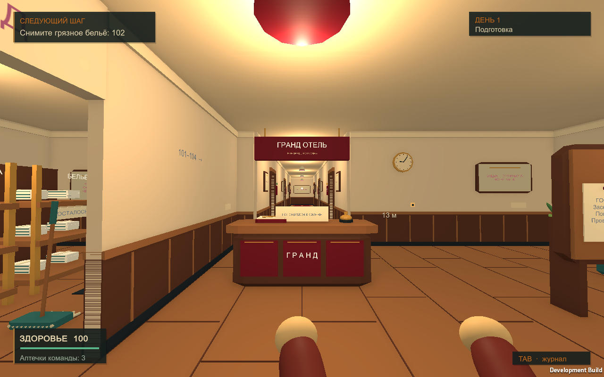
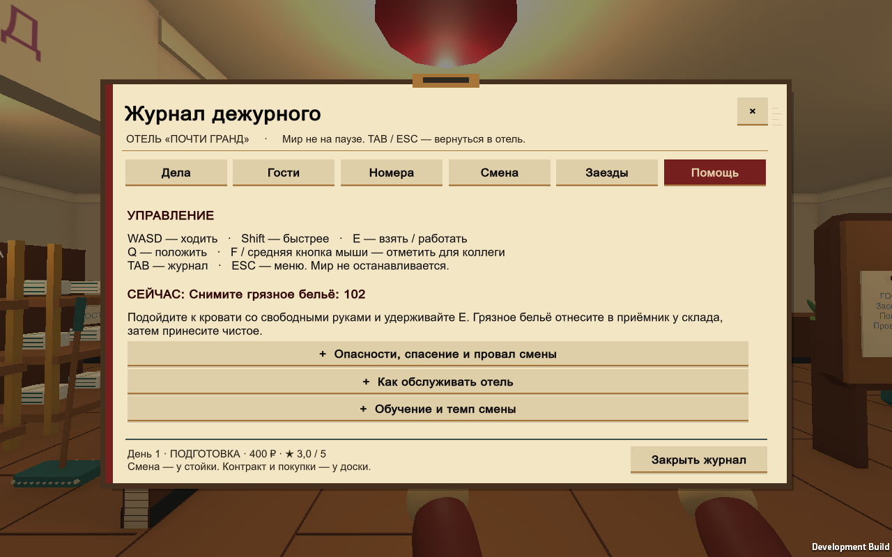

# Windows-кандидат 1.1.1-ui-alpha1

23 сентября 2026. Переделка интерфейса по обратной связи владельца. Это проверенная локально alpha-сборка, не коммерческий релиз и не подтверждение удобства людьми.

## Запуск

На компьютере разработчика: `Builds/WindowsUI/PLAYTEST_DANGER.cmd`. Для передачи другому игроку — весь архив `Builds/WorstHotelEver-1.1.1-ui-alpha1-Windows.zip`; распаковать полностью и запустить `PLAYTEST_DANGER.cmd`. Закрыть старую версию перед обычной игрой: этот launcher использует прежний отдельный danger-слот, два хоста не должны записывать его одновременно.

Tab — журнал дежурного, повторный Tab/ESC — закрыть. Постоянные справки и статистика убраны из обзора; текущая работа и срочная опасность показываются контекстно. Меню и журнал оформлены как бумажные документы отеля. [План](../UI_REDESIGN_PLAN.md), [подробный QA](qa-ui-alpha1.md), [инструкция игроку](../../README_DANGER.md).

## Зафиксированный кандидат

- Исходники и упаковщик: commit `35f14bc2314924252915a57424a3f7d72c380801`. Последующий commit с этим отчётом не изменяет runtime.
- Unity 6000.3.2f1, Windows x64, Mono/DX11, development build 1.1.1; 0 ошибок сборки, 1 предупреждение о неотправленных native symbols.
- Runtime SHA256: `0B0B508A7DFF9CE58578D966232D44506EF738CF599B984A97CF7B2719C98251`.
- ZIP: **59 168 568 байт, 131 файл**. SHA256: `2AEDE7FB18F910465B0A6635121EBCCE25C63859688F368E42F2A22716A76B85`.
- Каждый сжатый файл повторно прочитан и сверен по SHA256 с исходным. В архиве manifest, краткие результаты тестов, инструкция, UI-план/реальные кадры, диагностика, лицензии и нужные Steam-библиотеки. PDB и Burst DoNotShip не включены.

## Проверки

`Test-UICandidate.ps1`: **OVERALL_PASS** на указанном runtime; 21 native-набор, предыдущие Windows/MVP/danger-регрессии, десятидневный бот, локальный co-op напрямую и с задержками/потерями, сохранения и реальный Tab/Escape/E. Получены и просмотрены реальные кадры 960×600, 1280×800 и 1920×1080. Точная граница автоматических и визуальных проверок описана в QA.

ZIP дополнительно распакован в новую отдельную `Builds/UIArchiveCheck-20260923`. SHA256 извлечённого runtime совпал. Именно извлечённая игра дважды запущена с проверкой меню/пути тестового слота, оба процесса завершились с PASS и кодом 0. Неизменность основного, MVP и danger слотов и всех трёх backup проверена. Доказательство: `TestResults/ui-archive-slot-results.txt`, кадр `TestResults/danger-playtest-menu.png`.

Основной save сохранил SHA256 `31E9E9478B221F4DE3DEF9E3069868DBA193A87AE96D95C944848F185213DF80`. Старые `Builds/Windows` и ZIP 1.1.0-danger-alpha1, MVP RC1 и pre-MVP 0.4 не изменились. Пользовательский `.vsconfig` не изменялся и не включался в коммиты.

## Не закрытые этой итерацией критерии

Мышиная навигация всеми кнопками, удобство живой сессии и субъективная интересность требуют человеческого плейтеста. Автоматика раскрывала справочные блоки через fixtures; это не имитация человеческих кликов. Интернет-кооператив Steam между двумя физическими ПК/аккаунтами не подтверждён. Игровой формат v3 и сетевой протокол `WHE-danger-5` не менялись.

## Реальные кадры

